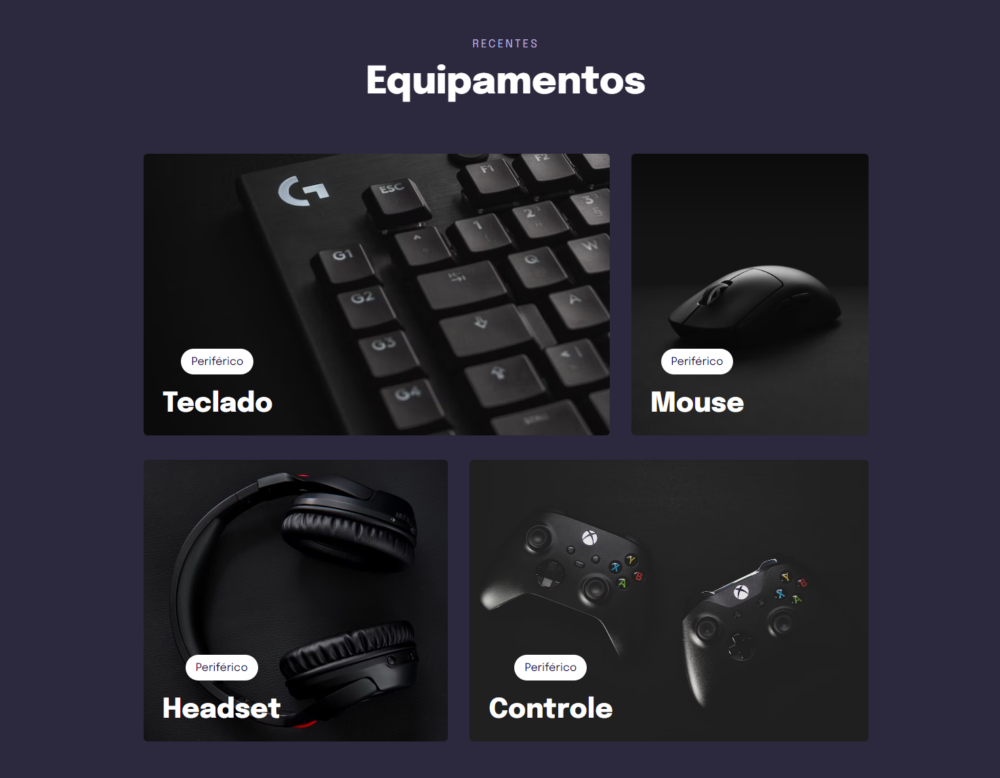

# Explorer Stage 03 | Projeto 05 - Transição e Animações

> Explorer

Projeto foi desenvolvido para o curso de formação da Rocketseat Explorer stage 03 da turma 6.0, este projeto simples consiste na aplicação de transição e animação dos elementos.

🔗[Clique aqui para acessar](https://explorer-stage3-pj5.vercel.app/)

## 💻 Tecnologias

- HTML
- CSS
